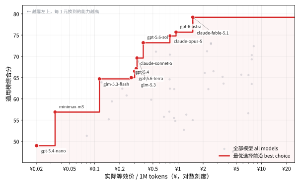

# AI 前沿模型排行

多源公开基准聚合的前沿大模型榜单，覆盖通用能力、写作能力和订阅套餐性价比三个视角。只收约 40 个主流旗舰模型，价格同时给出美元与人民币（实时汇率），每月自动更新。

## 这个榜单怎么做

大多数公开榜单要么只看一家的合成指数，要么把几百个长尾模型堆在一起凑数。这里的做法不同：

- 只收国际和国内主流厂商的旗舰（约 40 个）。长尾模型没人用，堆着只会稀释参考价值。
- 四个独立源交叉聚合：LiveBench、DeepSWE、EQ-Bench、Artificial Analysis。单一来源有偏见，交叉验证更可信。
- 固定锚点打分：按指标理论范围换算 0–100 分，不做「样本第一 = 100」的名次分。加新模型不影响已有分数，分数反映真实差距。
- 美元与人民币双币价，汇率每次构建实时抓取。

## 通用榜 Top 15

编程、智能体、日常混合使用看这张。权重：编码 25%、Agent 25%、指令遵循 15%、长上下文 10%、事实 15%、知识 10%。

<!--SNAPSHOT_GENERAL_START-->
> 2026-08-16 抓取（42 精选模型 -> 42 行）。
> 填补验证：LiveBench Coding MAE=2.80 (>10%: 5.0%/40) ; DeepSWE MAE=10.45 (>10%: 66.7%/24) ; LiveBench Agentic Coding MAE=3.84 (>10%: 20.0%/40) ; LiveBench Instruction Following MAE=4.27 (>10%: 17.5%/40) ; LCR MAE=0.03 (>10%: 4.9%/41) ; Omniscience Index MAE=9.48 (>10%: 95.1%/41) ; GPQA Diamond MAE=0.01 (>10%: 0.0%/41) ; HLE MAE=0.03 (>10%: 26.8%/41)
<!--SNAPSHOT_GENERAL_END-->

<!--TOP15_GENERAL_START-->
| # | Model | Creator | Score | Imputed |
|---|---|---|---|---|
| 1 | claude-fable-5 | Anthropic | 77.9 | - |
| 2 | claude-opus-5 | Anthropic | 74.8 | - |
| 3 | gpt-5.6-sol | OpenAI | 73.2 | - |
| 4 | gemini-3.7-flash | Google | 72.6 | LCR(reg), Omniscience Index(reg), GPQA Diamond(reg), HLE(reg) |
| 5 | kimi-k3 | Moonshot AI | 72.4 | - |
| 6 | grok-4.6 | xAI | 71.2 | - |
| 7 | gpt-5.5 | OpenAI | 71.1 | - |
| 8 | claude-opus-4.8 | Anthropic | 70.4 | - |
| 9 | muse-spark-1.2 | Meta | 70.3 | - |
| 10 | muse-spark-1.1 | Meta | 69.3 | - |
| 11 | claude-opus-4.7 | Anthropic | 68.5 | DeepSWE(reg) |
| 12 | claude-sonnet-5 | Anthropic | 67.1 | - |
| 13 | gemini-3.6-flash | Google | 66.5 | - |
| 14 | gpt-5.6-terra | OpenAI | 66.5 | - |
| 15 | grok-4.5 | xAI | 66.1 | - |
<!--TOP15_GENERAL_END-->

[完整排名 CSV](results/general_scored.csv)

## 文本榜 Top 15

写小说、日常问答看这张。权重：创意写作 25%、事实 20%、指令遵循 20%、知识 20%、长上下文 15%。

<!--SNAPSHOT_TEXT_START-->
> 2026-08-16 抓取（42 精选模型 -> 42 行）。
> 填补验证：EQ-Bench Creative Writing MAE=111.05 (>10%: 17.2%/29) ; LiveBench Language MAE=3.28 (>10%: 5.0%/40) ; Omniscience Index MAE=9.48 (>10%: 95.1%/41) ; LiveBench Instruction Following MAE=4.27 (>10%: 17.5%/40) ; GPQA Diamond MAE=0.01 (>10%: 0.0%/41) ; HLE MAE=0.03 (>10%: 26.8%/41) ; LCR MAE=0.03 (>10%: 4.9%/41)
<!--SNAPSHOT_TEXT_END-->

<!--TOP15_TEXT_START-->
| # | Model | Creator | Score | Imputed |
|---|---|---|---|---|
| 1 | claude-fable-5 | Anthropic | 77.1 | - |
| 2 | claude-opus-5 | Anthropic | 76.9 | - |
| 3 | kimi-k3 | Moonshot AI | 73.7 | - |
| 4 | gpt-5.6-sol | OpenAI | 71.8 | - |
| 5 | muse-spark-1.1 | Meta | 70.3 | - |
| 6 | muse-spark-1.2 | Meta | 69.6 | EQ-Bench Creative Writing(reg) |
| 7 | claude-opus-4.8 | Anthropic | 68.9 | - |
| 8 | gemini-3.7-flash | Google | 68.6 | Omniscience Index(reg), GPQA Diamond(reg), HLE(reg), LCR(reg) |
| 9 | claude-opus-4.7 | Anthropic | 68.4 | - |
| 10 | gpt-5.5 | OpenAI | 68.3 | - |
| 11 | grok-4.6 | xAI | 67.4 | EQ-Bench Creative Writing(reg) |
| 12 | gemini-3.5-flash | Google | 65.1 | EQ-Bench Creative Writing(reg) |
| 13 | gemini-3.1-pro | Google | 64.6 | - |
| 14 | gpt-5.4 | OpenAI | 64.2 | - |
| 15 | qwen3.8-max | Alibaba | 63.8 | - |
<!--TOP15_TEXT_END-->

[完整排名 CSV](results/text_scored.csv)

## 性价比榜 Top 15

回答「买哪个套餐最划算」。行序跟通用榜一致——按性价比排会让便宜小模型霸榜，没有决策价值。各列含义：API $/1M 是官方按量混合价（含缓存命中假设）；套餐内 $/1M 是该厂商最优订阅折算后的等效价；倍率是每 1 元月费换到的 API 等价额度，70× 即 $1 月费约换 $70 额度；Value = 综合分 ÷ 套餐内 $/1M。套餐名就是官方购买链接，没有订阅制的厂商按 API 按量计费（1×）。

<!--SNAPSHOT_VALUE_START-->
> 2026-08-16 抓取（42 精选模型 -> 42 行）。
> 填补验证：LiveBench Coding MAE=2.80 (>10%: 5.0%/40) ; DeepSWE MAE=10.45 (>10%: 66.7%/24) ; LiveBench Agentic Coding MAE=3.84 (>10%: 20.0%/40) ; LiveBench Instruction Following MAE=4.27 (>10%: 17.5%/40) ; LCR MAE=0.03 (>10%: 4.9%/41) ; Omniscience Index MAE=9.48 (>10%: 95.1%/41) ; GPQA Diamond MAE=0.01 (>10%: 0.0%/41) ; HLE MAE=0.03 (>10%: 26.8%/41)
<!--SNAPSHOT_VALUE_END-->

<!--TOP15_VALUE_START-->
| # | Model | Creator | Score | API $/1M | 套餐 | 月费 | 倍率 | 套餐内 $/1M | 套餐内 ¥/1M | Value |
|---|---|---|---|---|---|---|---|---|---|---|
| 1 | claude-fable-5 | Anthropic | 77.9 | 9.076 | [Claude Max 20x](https://claude.com/pricing) | $200 | 40× | 0.227 | 1.53 | 343.23 |
| 2 | claude-opus-5 | Anthropic | 74.8 | 4.749 | [Claude Max 20x](https://claude.com/pricing) | $200 | 40× | 0.119 | 0.802 | 628.61 |
| 3 | gpt-5.6-sol | OpenAI | 73.2 | 5.69 | [ChatGPT Pro 20x](https://chatgpt.com/pricing) | $200 | 70× | 0.08 | 0.539 | 914.57 |
| 4 | gemini-3.7-flash | Google | 72.6 |  | API 按量 | - | 1× |  |  |  |
| 5 | kimi-k3 | Moonshot AI | 72.4 | 4.102 | [Kimi 会员 Allegretto](https://www.kimi.com/membership/pricing) | $27.6 | 4.5× | 0.902 | 6.08 | 80.31 |
| 6 | grok-4.6 | xAI | 71.2 | 1.771 | [SuperGrok Heavy](https://x.ai/pricing) | $300 | 5.3× | 0.337 | 2.272 | 211.16 |
| 7 | gpt-5.5 | OpenAI | 71.1 | 5.69 | [ChatGPT Pro 20x](https://chatgpt.com/pricing) | $200 | 70× | 0.08 | 0.539 | 888.35 |
| 8 | claude-opus-4.8 | Anthropic | 70.4 | 4.749 | [Claude Max 20x](https://claude.com/pricing) | $200 | 40× | 0.119 | 0.802 | 591.84 |
| 9 | muse-spark-1.2 | Meta | 70.3 | 1.139 | API 按量 | - | 1× | 1.139 | 7.678 | 61.75 |
| 10 | muse-spark-1.1 | Meta | 69.3 | 1.139 | API 按量 | - | 1× | 1.139 | 7.678 | 60.85 |
| 11 | claude-opus-4.7 | Anthropic | 68.5 | 4.749 | [Claude Max 20x](https://claude.com/pricing) | $200 | 40× | 0.119 | 0.802 | 575.28 |
| 12 | claude-sonnet-5 | Anthropic | 67.1 | 1.899 | [Claude Max 20x](https://claude.com/pricing) | $200 | 40× | 0.047 | 0.317 | 1427.47 |
| 13 | gemini-3.6-flash | Google | 66.5 | 1.482 | [GitHub Copilot Max](https://github.com/features/copilot/plans) | $100 | 2× | 0.741 | 4.995 | 89.79 |
| 14 | gpt-5.6-terra | OpenAI | 66.5 | 3.133 | [ChatGPT Pro 20x](https://chatgpt.com/pricing) | $200 | 70× | 0.044 | 0.297 | 1510.99 |
| 15 | grok-4.5 | xAI | 66.1 | 1.661 | [SuperGrok Heavy](https://x.ai/pricing) | $300 | 5.3× | 0.316 | 2.13 | 209.19 |
<!--TOP15_VALUE_END-->

[完整排名 CSV](results/value_scored.csv)

Imputed 列：`-` 表示全部真实值，`指标(reg)` 是岭回归填补，`指标(reg,low)` 是低可信填补。性价比榜完整 CSV 里还有 `Blended $/1M`（无折扣混合价）和 `Plan Monthly / Multiplier / Discount / URL` 等套餐明细列。

## 能力-成本曲线

每个点是一个模型：横轴是实际支付价（最优订阅套餐折算后的等效价，无订阅厂商即官方按量混合价；对数刻度），纵轴是通用榜综合分。红色阶梯线是最优选择前沿——给定你的预算，在横轴上定位预算位置，前沿在该处的高度就是这笔预算能买到的最强模型（例如预算约 ¥0.5/M 时是 gpt-5.6-sol，¥1.5/M 时已是 claude-fable-5）。左图美元、右图人民币（实时汇率）。

<!--FRONTIER_START-->

<!--FRONTIER_END-->

## 套餐购买指南

按订阅维度直接对比「买哪家最值」。每个套餐取它覆盖的厂商里通用榜最强的模型，按「套餐内 Value = 最强模型分 ÷ 该套餐下等效价」从高到低排。这个排法同时反映两件事：套餐能用到多强的模型、折算后到底多便宜，不是单纯比谁额度大。

各列口径：

- 倍率 = 每 1 元月费换到的 API 等价额度；折扣 = 套餐内单价 ÷ 官方单价
- ≈Token/月：官方公布了 token 池的直接引用（MiniMax、GLM、混元、MiMo）；没公布的按「API 等价价值 ÷ 最强模型官方混合价」估算，即额度全部用于该模型时的量，实际用便宜模型能换到更多

数据来源与时点：ChatGPT / Claude 倍率来自 SemiAnalysis 2026-06 实测，Copilot 是 GitHub 官方额度，Grok 为 agentplans.fyi 2026-06 估算，Kimi 为社区实测，国内各家为 2026-08 官方页面实查，聚合与 IDE 类（OpenCode Go、Factory、Trae、Cursor）为 awesome-coding-plan 2026-08 第三方实测。倍率一律按用满额度上限计算，轻度用户实际拿不到这么多。国内套餐标价为人民币，¥/月 按实时汇率折算。

两类没给倍率的需要说明。千问 Token Plan 和 WorkBuddy 是积分制，官方没公布积分换 token 的系数，社区两套口径相差 5 到 10 倍，给数字等于编数，所以只列官方积分额度；WorkBuddy 的 token 量按社区实测「1 积分 ≈ 4,100 token」折了个大概，仅供参考。另外，Gemini 官方订阅不含 API 额度，不进表，编程需求可以由 GitHub Copilot 覆盖；DeepSeek 没有自有订阅制（腾讯通用 Token Plan 提供第三方折扣）。

<!--PLANS_GUIDE_START-->
| # | 套餐 | 月费 | ¥/月 | 倍率 | 折扣 | ≈Token/月 | 最强模型（通用榜） | 模型分 | 套餐内 $/1M | Value |
|---|---|---|---|---|---|---|---|---|---|---|
| 1 | [MiniMax Max Token Plan](https://platform.minimaxi.com/subscribe/token-plan) | $16.5 | ¥111 | 53× | 1.9% | 18亿+ | minimax-m3 (#35) | 55.1 | 0.005 | 11983.5 |
| 2 | [MiniMax Plus Token Plan](https://platform.minimaxi.com/subscribe/token-plan) | $6.8 | ¥46 | 42.9× | 2.3% | 6亿+ | minimax-m3 (#35) | 55.1 | 0.006 | 9899.4 |
| 3 | [MiniMax Ultra Token Plan](https://platform.minimaxi.com/subscribe/token-plan) | $65.1 | ¥439 | 41.1× | 2.4% | 55亿 | minimax-m3 (#35) | 55.1 | 0.006 | 9486.9 |
| 4 | [GLM Coding Plan Max](https://bigmodel.cn/glm-coding) | $149.7 | ¥1009 | 29× | 3.4% | ≈26~53亿/月 | glm-5.2 (#24) | 62.4 | 0.037 | 1666.9 |
| 5 | [GLM Coding Plan Pro](https://bigmodel.cn/glm-coding) | $74.7 | ¥504 | 25.2× | 4.0% | ≈11~23亿/月 | glm-5.2 (#24) | 62.4 | 0.044 | 1416.9 |
| 6 | [GLM Coding Plan Lite](https://bigmodel.cn/glm-coding) | $16.4 | ¥111 | 18.8× | 5.3% | ≈2~4亿/月 | glm-5.2 (#24) | 62.4 | 0.058 | 1069.4 |
| 7 | [ChatGPT Pro 20x](https://chatgpt.com/pricing) | $200 | ¥1348 | 70× | 1.4% | ≈25亿 | gpt-5.6-sol (#3) | 73.2 | 0.08 | 918.9 |
| 8 | [腾讯通用 Token Plan Standard](https://cloud.tencent.com/act/pro/tokenplan) | $13.8 | ¥93 | 2× | 50.0% | 1亿/月 | deepseek-v4-pro (#18) | 65.1 | 0.089 | 731.5 |
| 9 | [Hy Token Plan Max](https://cloud.tencent.com/act/pro/tokenplan) | $65 | ¥438 | 1.4× | 73.5% | 6.5亿/月 | hy3 (#37) | 54.6 | 0.1 | 546.2 |
| 10 | [Hy Token Plan Lite](https://cloud.tencent.com/act/pro/tokenplan) | $3.9 | ¥26 | 1.2× | 81.0% | 3500万/月 | hy3 (#37) | 54.6 | 0.11 | 495.6 |
| 11 | [ChatGPT Plus](https://chatgpt.com/pricing) | $20 | ¥135 | 35× | 2.9% | ≈1亿 | gpt-5.6-sol (#3) | 73.2 | 0.165 | 443.6 |
| 12 | [Claude Max 20x](https://claude.com/pricing) | $200 | ¥1348 | 40× | 2.5% | ≈9亿 | claude-fable-5 (#1) | 77.9 | 0.227 | 343.3 |
| 13 | [OpenCode Go](https://opencode.ai/go) | $10 | ¥67 | 6× | 16.7% | $60/月（$60 档模型） | glm-5.2 (#24) | 62.4 | 0.184 | 339.4 |
| 14 | [MiMo Token Plan Max](https://mimo.mi.com/docs/zh-CN/price/token-plan) | $100 | ¥674 | 1.3× | 79.0% | ≈4.5亿/月 | mimo-v2.5-pro (#32) | 57.1 | 0.221 | 258.1 |
| 15 | [MiMo Token Plan Lite](https://mimo.mi.com/docs/zh-CN/price/token-plan) | $6 | ¥40 | 1.1× | 94.0% | ≈2300万/月 | mimo-v2.5-pro (#32) | 57.1 | 0.263 | 216.9 |
| 16 | [SuperGrok Heavy](https://x.ai/pricing) | $300 | ¥2022 | 5.3× | 19.0% | ≈9亿 | grok-4.6 (#6) | 71.2 | 0.336 | 211.6 |
| 17 | [SuperGrok](https://x.ai/pricing) | $30 | ¥202 | 5.3× | 19.0% | ≈0.9亿 | grok-4.6 (#6) | 71.2 | 0.336 | 211.6 |
| 18 | [Claude Max 5x](https://claude.com/pricing) | $100 | ¥674 | 20× | 5.0% | ≈2亿 | claude-fable-5 (#1) | 77.9 | 0.454 | 171.7 |
| 19 | [Claude Pro](https://claude.com/pricing) | $20 | ¥135 | 20× | 5.0% | ≈0.4亿 | claude-fable-5 (#1) | 77.9 | 0.454 | 171.7 |
| 20 | [Kimi 会员 Allegretto](https://www.kimi.com/membership/pricing) | $27.6 | ¥186 | 4.5× | 22.0% | ≈0.3亿 | kimi-k3 (#5) | 72.4 | 0.902 | 80.2 |
| 21 | [Kimi Andante](https://www.kimi.com/membership/pricing) | $6.8 | ¥46 | 2.5× | 40.5% | 8400万/月（K2.5） | kimi-k3 (#5) | 72.4 | 1.661 | 43.6 |
| 22 | [Factory Droid Pro](https://factory.ai) | $20 | ¥135 | 2.4× | 41.7% | 2000万标准token | claude-fable-5 (#1) | 77.9 | 3.785 | 20.6 |
| 23 | [GitHub Copilot Max](https://github.com/features/copilot/plans) | $100 | ¥674 | 2× | 50.0% | ≈0.2亿 | claude-fable-5 (#1) | 77.9 | 4.538 | 17.2 |
| 24 | [Trae Pro](https://www.trae.ai) | $10 | ¥67 | 2× | 50.0% | $20 基础用量 | claude-fable-5 (#1) | 77.9 | 4.538 | 17.2 |
| 25 | [GitHub Copilot Pro+](https://github.com/features/copilot/plans) | $39 | ¥263 | 1.8× | 55.7% | ≈8M | claude-fable-5 (#1) | 77.9 | 5.055 | 15.4 |
| 26 | [GitHub Copilot Pro](https://github.com/features/copilot/plans) | $10 | ¥67 | 1.5× | 66.7% | ≈2M | claude-fable-5 (#1) | 77.9 | 6.054 | 12.9 |
| | *—— 以下为积分/任务制套餐（官方未公布 Credits→token 换算，不参与倍率排序）——* | | | | | | | | | |
| 27 | [Qwen Token Plan Lite](https://platform.qianwenai.com/pricing/token-plan) | $5.4 | ¥36 | - | - | 2,500 Credits/7天 | qwen3.8-max (#17) | 65.6 | 1.559 | 42.1 |
| 28 | [WorkBuddy 标准版](https://www.workbuddy.cn/docs/workbuddy/Pricing) | $13.8 | ¥93 | - | - | ≈1600万/月 | hy3 (#37) | 54.6 | 0.136 | 401.5 |
| 29 | [Qwen Token Plan Standard](https://platform.qianwenai.com/pricing/token-plan) | $19.3 | ¥130 | - | - | 10,000 Credits/7天 | qwen3.8-max (#17) | 65.6 | 1.559 | 42.1 |
| 30 | [Cursor Pro](https://cursor.com/pricing) | $20 | ¥135 | - | - | $20 API 用量 | claude-fable-5 (#1) | 77.9 | 9.076 | 8.6 |
| 31 | [WorkBuddy 高级版](https://www.workbuddy.cn/docs/workbuddy/Pricing) | $27.6 | ¥186 | - | - | ≈3700万/月 | hy3 (#37) | 54.6 | 0.136 | 401.5 |
| 32 | [WorkBuddy 旗舰版](https://www.workbuddy.cn/docs/workbuddy/Pricing) | $138.8 | ¥936 | - | - | ≈2亿/月 | hy3 (#37) | 54.6 | 0.136 | 401.5 |
<!--PLANS_GUIDE_END-->

---

## 数据源

| 源 | 测什么 | 维护方 | 抗污染 |
|---|---|---|---|
| [LiveBench](https://livebench.ai) | 编码 / Agentic Coding / 指令遵循 / 语言 | Abacus.AI + 学界 | ✅ 半年刷新 |
| [DeepSWE](https://deepswe.datacurve.ai) | 长程软件工程 agent | Datacurve | ✅ 原创任务 |
| [EQ-Bench](https://eqbench.com) | 创意写作 | 独立（LLM-judge） | ⚠️ 主观维度 |
| [Artificial Analysis](https://artificialanalysis.ai) | 长上下文 / 事实性 / 知识 | 独立评测机构 | ✅ 第三方统一跑分 |
| [Frankfurter](https://frankfurter.dev) | USD→CNY 汇率（ECB 官方） | 开源 | — |

## 权重与打分

固定锚点打分：每项指标按理论范围换算到 0–100 分，再按权重加权。

- 通用榜：编码 25%（LiveBench Coding）、Agent 25%（DeepSWE 60% + Agentic Coding 40%）、指令遵循 15%、长上下文 10%（LCR）、事实 15%（Omniscience）、知识 10%（GPQA 30% + HLE 70%）
- 文本榜：创意写作 25%（EQ-Bench 70% + Language 30%）、事实 20%、指令遵循 20%、知识 20%、长上下文 15%
- 性价比榜：与通用榜同权重同名次，展示官方 API 价与最优订阅折算价（含倍率和购买链接），Value = 综合分 ÷ 套餐内 $/1M；配套的套餐购买指南按套餐内性价比排序

[完整方法论](METHODOLOGY.md)

## FAQ

**为什么只有 40 个模型？**

几百个模型里九成是重复变体、长尾小厂和已弃用条目，真正有人用的就这几十个。榜单定位是精选，不是堆量。

**分数为什么不像别家那么高，连 90 都见不到？**

不做 min-max 名次分。DeepSWE 最好的模型也只有 74%，那就写 74，不硬抬成 100。分数是能力，不是名次。

**为什么不用 SWE-bench？**

SWE-bench Verified 已经饱和，前沿厂商陆续停止报告（OpenAI 因污染问题退出），它的榜单停在旧模型上。真实工程能力由 DeepSWE 和 LiveBench Agentic Coding 覆盖。

**汇率哪来的？**

每次构建实时抓取 Frankfurter（ECB 官方参考价），失败时回退 open.er-api.com，不硬编码。

## 复现

```bash
pip install -r requirements.txt
python scripts/build.py            # 完整构建（抓取 + 合并 + 评分 + README）
python scripts/build.py --offline  # 离线复算缓存
python -m pytest -q                # 测试
```

GitHub Actions 每月 1 号自动更新。

## License

评分脚本与整理结果：MIT。原始数据版权归各基准维护方。
